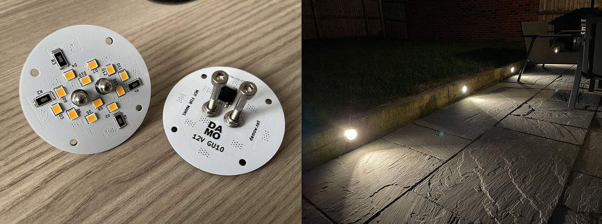
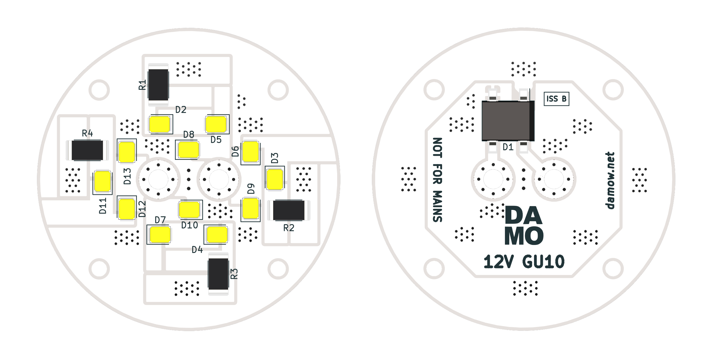

# `gu10-12v-lamp`

This is a [GU10](https://en.wikipedia.org/wiki/Bi-pin_lamp_base#Types) style lamp for **12V** use, ideal for situations where a mains lighting system has been converted to 12V. The driverless design makes them compatible with PWM-based or voltage-based dimming. An integral diode bridge allows insertion in any orientation. They are made with standard FR4 PCB rather than Aluminium for lower cost.

This is a KiCad (5.1.9-0-10_14) project.

Gerbers, schematic & BOM may be found in the `outputs` directory.

After production, a sandwich of **M3** 30mm (or shorter/longer, depending on your fitting depth) standard cap-head machine screws, bolts and washers can be fitted through the central holes to produce GU10 compatible "lugs" for insertion into a standard GU10 bayonet lamp holder.

For outdoor use I'd suggest conformally coating the boards on the top and bottom sides _after_ insertion of the M3 fasteners.

**These lamps are for 12V DC only. Do not connect these lamps to mains voltage.**

Standard 2835 LED chips are used (I used 3000K 150mA 2.95Vf [CREE J Series® JB2835AWT-W-U30GA0000-N0000001](https://www.digikey.co.uk/en/products/detail/cree-inc/JB2835AWT-W-U30GA0000-N0000001/10820387)). LEDs are in 4 groups of (3 chips in series) with a resistor for each group. I'd recommend using 39Ω 2512-size resistors (for a LED current of ~40mA) and a total lamp current of 160mA (~2W excluding the drop across the diode bridge). The lamps stay at a sensible temperature at this power.

## Revisions

* **Issue A** - Initial release (used in the example photos above).
* **Issue B** - Improved layout for better thermals.

